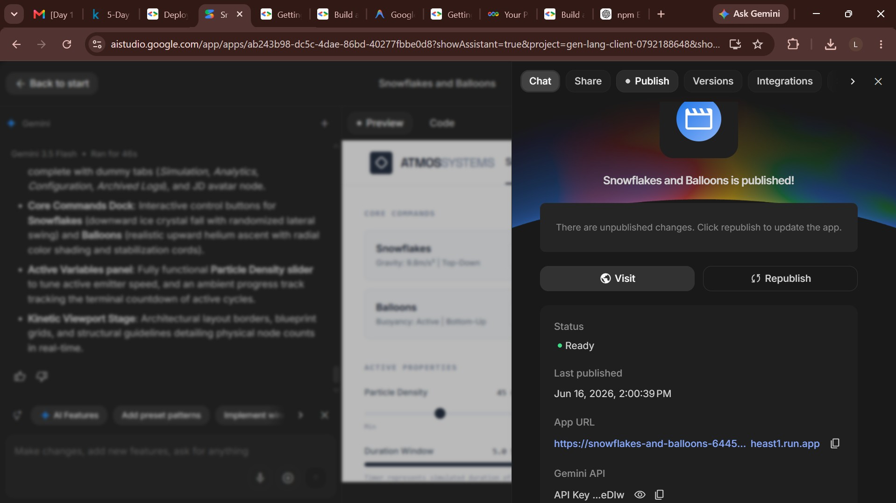
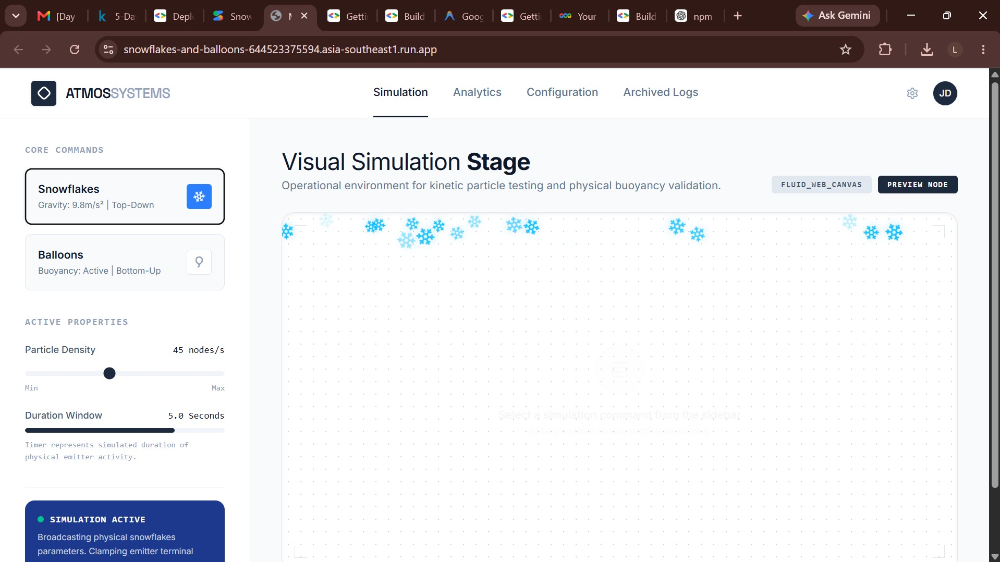
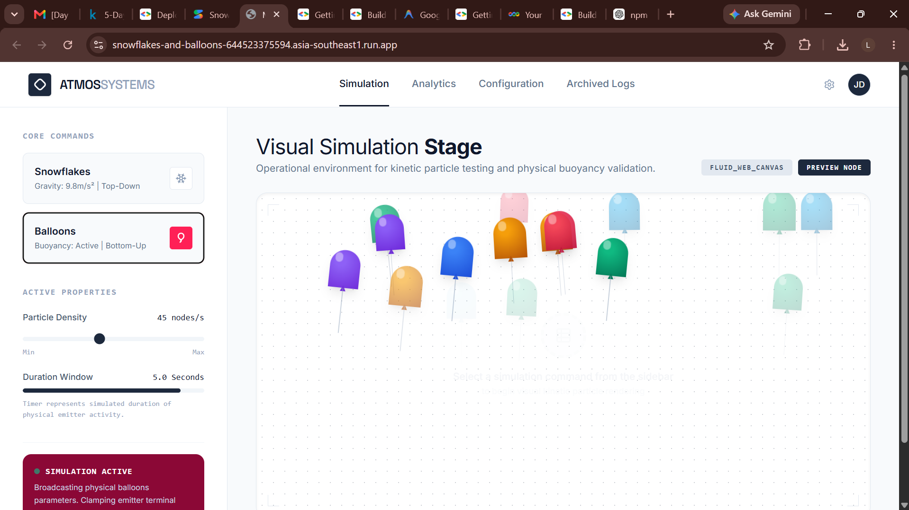

# Day 1 – Snowflakes and Balloons ❄️🎈

<div align="center">
  
</div>

## Overview

This project was created as part of the **Google & Kaggle 5-Day AI Agents Intensive** using **Google AI Studio**.

The goal was to generate a frontend application from a natural language prompt and deploy it using AI Studio's built-in publishing tools.

---

## Challenge Prompt

```text
Create a formal looking frontend application that has two buttons:
"Snowflakes" and "Balloons".

If the user clicks on the "Snowflakes" button, snowflakes of medium size
should start falling on the screen from top to bottom for 5 seconds.

If the user clicks on the "Balloons" button, balloons of medium size
should start floating from the bottom of the screen and float to the top
for 5 seconds.
```

---

## Result

The generated application includes:

- A clean and formal user interface
- A "Snowflakes" button that triggers falling snowflake animations
- A "Balloons" button that triggers floating balloon animations
- Timed animations that run for 5 seconds
- Responsive frontend behavior

---

## Screenshots

### Main Interface


### Publish Interface



### Snowflakes Animation



### Balloons Animation



> Replace the image names above with your actual screenshot filenames.

---

## Live Demo

🔗 **AI Studio App**

https://ai.studio/apps/ab243b98-dc5c-4dae-86bd-40277fbbe0d8

---

## Tech Stack

- React
- TypeScript
- Vite
- Gemini API
- Google AI Studio

---

## What I Learned

- How to transform natural language prompts into working applications
- Using Google AI Studio for rapid application development
- Reviewing and understanding AI-generated React code
- Deploying applications directly from AI Studio
- Managing AI-generated projects with GitHub

---


## Run Locally

### Prerequisites

- Node.js

### Installation

```bash
npm install
```

Create a `.env.local` file:

```env
GEMINI_API_KEY=your_api_key
```

Start the development server:

```bash
npm run dev
```


## Acknowledgements

Created during the **Google & Kaggle 5-Day AI Agents Intensive** using Google AI Studio.