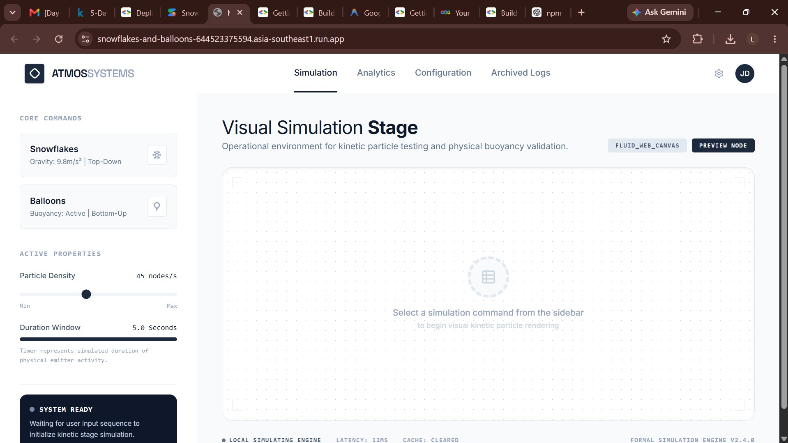

# Google-Kaggle-5-Day-AI-Agents-Intensive
Documenting my journey through the Google &amp; Kaggle 5-Day AI Agents Intensive program.
This repository documents my participation in the Google & Kaggle 5-Day AI Agents Intensive program.

## Overview

Over five days, I will explore AI agent development, prompt engineering, and application building using Google's AI tools.

## Progress

- [x] Day 1
- [x] Day 2
- [ ] Day 3
- [ ] Day 4
- [ ] Day 5

## Day 1 – Snowflakes and Balloons

A frontend application generated using Google AI Studio featuring interactive snowflake and balloon animations.

## Day 2 – BigQuery Release Notes Monitor & Twitter Agent

An interactive web application built with Python Flask and plain HTML/CSS/JS that monitors Google's BigQuery release notes XML feed in real-time. It splits feed entries into separate, filterable update cards and generates update tweets using customizable styles (Professional, Punchy, Dev-Rel) with a visual character limit progress ring.

## Repository Structure

day-1/
day-2/
day-3/
day-4/
day-5/

Each day contains:
- Original prompts
- Screenshots
- Published app links
- Notes and reflections
- Any exported code (if available)

## Key Learning Goals

- AI Agent Fundamentals
- Prompt Engineering
- Rapid Application Development
- Generative AI Workflows
- AI Tooling with Google AI Studio